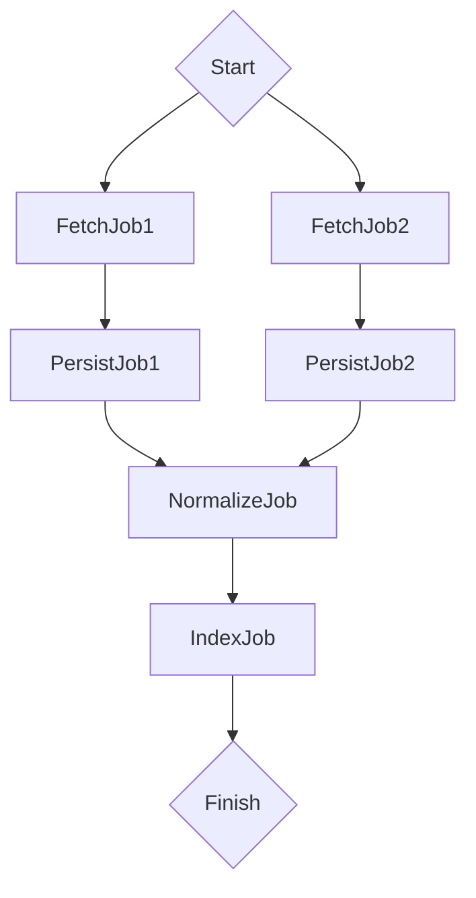
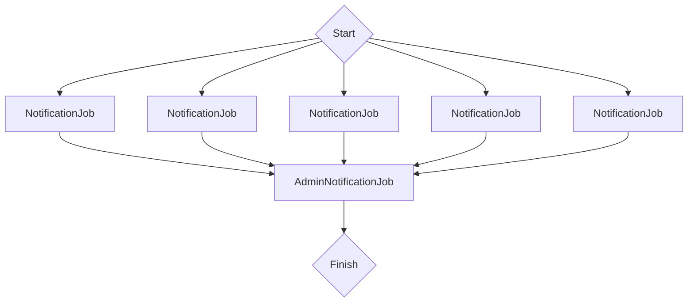

# Gush

Gush is a parallel workflow runner using only Redis as storage and [ActiveJob](http://guides.rubyonrails.org/v4.2/active_job_basics.html#introduction) for scheduling and executing jobs.

## Theory

Gush relies on directed acyclic graphs to store dependencies, see [Parallelizing Operations With Dependencies](https://msdn.microsoft.com/en-us/magazine/dd569760.aspx) by Stephen Toub to learn more about this method.

## **WARNING - version notice**

This README is about the latest `master` code, which might differ from what is released on RubyGems. See tags to browse previous READMEs.

## Installation

### 1. Add `gush` to Gemfile

```ruby
gem 'gush', '~> 2.1'
```

### 2. Create `Gushfile`

When using Gush and its CLI commands you need a `Gushfile` in the root directory.
`Gushfile` should require all your workflows and jobs.

#### Ruby on Rails

For RoR it is enough to require the full environment:

```ruby
require_relative './config/environment.rb'
```

and make sure your jobs and workflows are correctly loaded by adding their directories to autoload_paths, inside `config/application.rb`:

```ruby
config.autoload_paths += ["#{Rails.root}/app/jobs", "#{Rails.root}/app/workflows"]
```

#### Ruby

Simply require any jobs and workflows manually in `Gushfile`:

```ruby
require_relative 'lib/workflows/example_workflow.rb'
require_relative 'lib/jobs/some_job.rb'
require_relative 'lib/jobs/some_other_job.rb'
```


## Example

The DSL for defining jobs consists of a single `run` method.
Here is a complete example of a workflow you can create:

```ruby
# app/workflows/sample_workflow.rb
class SampleWorkflow < Gush::Workflow
  def configure(url_to_fetch_from)
    run FetchJob1, params: { url: url_to_fetch_from }
    run FetchJob2, params: { some_flag: true, url: 'http://url.com' }

    run PersistJob1, after: FetchJob1
    run PersistJob2, after: FetchJob2

    run Normalize,
        after: [PersistJob1, PersistJob2],
        before: Index

    run Index
  end
end
```

and this is how the graph will look like:




## Defining workflows

Let's start with the simplest workflow possible, consisting of a single job:

```ruby
class SimpleWorkflow < Gush::Workflow
  def configure
    run DownloadJob
  end
end
```

Of course having a workflow with only a single job does not make sense, so it's time to define dependencies:

```ruby
class SimpleWorkflow < Gush::Workflow
  def configure
    run DownloadJob
    run SaveJob, after: DownloadJob
  end
end
```

We just told Gush to execute `SaveJob` right after `DownloadJob` finishes **successfully**.

But what if your job must have multiple dependencies? That's easy, just provide an array to the `after` attribute:

```ruby
class SimpleWorkflow < Gush::Workflow
  def configure
    run FirstDownloadJob
    run SecondDownloadJob

    run SaveJob, after: [FirstDownloadJob, SecondDownloadJob]
  end
end
```

Now `SaveJob` will only execute after both its parents finish without errors.

With this simple syntax you can build any complex workflows you can imagine!

#### Alternative way

`run` method also accepts `before:` attribute to define the opposite association. So we can write the same workflow as above, but like this:

```ruby
class SimpleWorkflow < Gush::Workflow
  def configure
    run FirstDownloadJob, before: SaveJob
    run SecondDownloadJob, before: SaveJob

    run SaveJob
  end
end
```

You can use whatever way you find more readable or even both at once :)

### Passing arguments to workflows

Workflows can accept any primitive arguments in their constructor, which then will be available in your
`configure` method.

Let's assume we are writing a book publishing workflow which needs to know where the PDF of the book is and under what ISBN it will be released:

```ruby
class PublishBookWorkflow < Gush::Workflow
  def configure(url, isbn)
    run FetchBook, params: { url: url }
    run PublishBook, params: { book_isbn: isbn }, after: FetchBook
  end
end
```

and then create your workflow with those arguments:

```ruby
PublishBookWorkflow.create("http://url.com/book.pdf", "978-0470081204")
```

and that's basically it for defining workflows, see below on how to define jobs:

## Defining jobs

The simplest job is a class inheriting from `Gush::Job` and responding to `perform` method. Much like any other ActiveJob class.

```ruby
class FetchBook < Gush::Job
  def perform
    # do some fetching from remote APIs
  end
end
```

But what about those params we passed in the previous step?

## Passing parameters into jobs

To do that, simply provide a `params:` attribute with a hash of parameters you'd like to have available inside the `perform` method of the job.

So, inside workflow:

```ruby
(...)
run FetchBook, params: {url: "http://url.com/book.pdf"}
(...)
```

and within the job we can access them like this:

```ruby
class FetchBook < Gush::Job
  def perform
    # you can access `params` method here, for example:

    params #=> {url: "http://url.com/book.pdf"}
  end
end
```

## Executing workflows

Now that we have defined our workflow and its jobs, we can use it:

### 1. Start background worker process

**Important**: The command to start background workers depends on the backend you chose for ActiveJob.
For example, in case of Sidekiq this would be:

```
bundle exec sidekiq -q gush
```

**[Click here to see backends section in official ActiveJob documentation about configuring backends](http://guides.rubyonrails.org/active_job_basics.html#backends)**

**Hint**: gush uses `gush` queue name by default. Keep that in mind, because some backends (like Sidekiq) will only run jobs from explicitly stated queues.


### 2. Create the workflow instance

```ruby
flow = PublishBookWorkflow.create("http://url.com/book.pdf", "978-0470081204")
```

### 3. Start the workflow

```ruby
flow.start!
```

Now Gush will start processing jobs in the background using ActiveJob and your chosen backend.

### 4. Monitor its progress:

```ruby
flow.reload
flow.status
#=> :running|:finished|:failed
```

`reload` is needed to see the latest status, since workflows are updated asynchronously.

## Advanced features

### Pipelining

Gush offers a useful tool to pass results of a job to its dependencies, so they can act differently.

**Example:**

Let's assume you have two jobs, `DownloadVideo`, `EncodeVideo`.
The latter needs to know where the first one saved the file to be able to open it.


```ruby
class DownloadVideo < Gush::Job
  def perform
    downloader = VideoDownloader.fetch("http://youtube.com/?v=someytvideo")

    output(downloader.file_path)
  end
end
```

`output` method is used to ouput data from the job to all dependant jobs.

Now, since `DownloadVideo` finished and its dependant job `EncodeVideo` started, we can access that payload inside it:

```ruby
class EncodeVideo < Gush::Job
  def perform
    video_path = payloads.first[:output]
  end
end
```

`payloads` is an array containing outputs from all ancestor jobs. So for our `EncodeVideo` job from above, the array will look like:


```ruby
[
  {
    id: "DownloadVideo-41bfb730-b49f-42ac-a808-156327989294" # unique id of the ancestor job
    class: "DownloadVideo",
    output: "https://s3.amazonaws.com/somebucket/downloaded-file.mp4" #the payload returned by DownloadVideo job using `output()` method
  }
]
```

**Note:** Keep in mind that payloads can only contain data which **can be serialized as JSON**, because that's how Gush stores them internally.

### Dynamic workflows

There might be a case when you have to construct the workflow dynamically depending on the input.

As an example, let's write a workflow which accepts an array of users and has to send an email to each one. Additionally after it sends the e-mail to every user, it also has to notify the admin about finishing.


```ruby

class NotifyWorkflow < Gush::Workflow
  def configure(user_ids)
    notification_jobs = user_ids.map do |user_id|
      run NotificationJob, params: {user_id: user_id}
    end

    run AdminNotificationJob, after: notification_jobs
  end
end
```

We can achieve that because `run` method returns the id of the created job, which we can use for chaining dependencies.

Now, when we create the workflow like this:

```ruby
flow = NotifyWorkflow.create([54, 21, 24, 154, 65]) # 5 user ids as an argument
```

it will generate a workflow with 5 `NotificationJob`s and one `AdminNotificationJob` which will depend on all of them:




### Dynamic queue for jobs

There might be a case you want to configure different jobs in the workflow using different queues. Based on the above the example, we want to config `AdminNotificationJob` to use queue `admin` and `NotificationJob` use queue `user`.

```ruby

class NotifyWorkflow < Gush::Workflow
  def configure(user_ids)
    notification_jobs = user_ids.map do |user_id|
      run NotificationJob, params: {user_id: user_id}, queue: 'user'
    end

    run AdminNotificationJob, after: notification_jobs, queue: 'admin'
  end
end
```

### Dynamic waitable time for jobs

There might be a case you want to configure a job to be executed after a time. Based on above example, we want to configure `AdminNotificationJob` to be executed after 5 seconds.

```ruby

class NotifyWorkflow < Gush::Workflow
  def configure(user_ids)
    notification_jobs = user_ids.map do |user_id|
      run NotificationJob, params: {user_id: user_id}, queue: 'user'
    end

    run AdminNotificationJob, after: notification_jobs, queue: 'admin', wait: 5.seconds
  end
end
```

## Command line interface (CLI)

### Checking status

- of a specific workflow:

  ```
  bundle exec gush show <workflow_id>
  ```

- of all created workflows:

  ```
  bundle exec gush list
  ```

### Vizualizing workflows as image

This requires that you have imagemagick installed on your computer:


```
bundle exec gush viz <NameOfTheWorkflow>
```

### Customizing locking options

In order to prevent getting the RedisMutex::LockError error when having a large number of jobs, you can customize these 2 fields `locking_duration` and `polling_interval` as below

```ruby
# config/initializers/gush.rb
Gush.configure do |config|
  config.redis_url = "redis://localhost:6379"
  # NB: you can also pass redis options as a hash:
  # config.redis = { host: "localhost", port: 6379, db: 1 }
  config.concurrency = 5
  config.locking_duration = 2 # how long you want to wait for the lock to be released, in seconds
  config.polling_interval = 0.3 # how long the polling interval should be, in seconds
end
```

### Cleaning up afterwards

Running `NotifyWorkflow.create` inserts multiple keys into Redis every time it is ran.  This data might be useful for analysis but at a certain point it can be purged via Redis TTL.  By default gush and Redis will keep keys forever.  To configure expiration you need to 2 things.  Create initializer (specify config.ttl in seconds, be different per environment).

```ruby
# config/initializers/gush.rb
Gush.configure do |config|
  config.redis_url = "redis://localhost:6379"
  # NB: you can also pass redis options as a hash:
  # config.redis = { host: "localhost", port: 6379, db: 1 }
  config.concurrency = 5
  config.ttl = 3600*24*7
end
```

And you need to call `flow.expire!` (optionally passing custom TTL value overriding `config.ttl`).  This gives you control whether to expire data for specific workflow.  Best NOT to set TTL to be too short (like minutes) but about a week in length.  And you can run `Client.expire_workflow` and `Client.expire_job` passing appropriate IDs and TTL (pass -1 to NOT expire) values.

### Avoid overlapping workflows

Since we do not know how long our workflow execution will take we might want to avoid starting the next scheduled workflow iteration while the current one with same class is still running.  Long term this could be moved into core library, perhaps `Workflow.find_by_class(klass)`

```ruby
# config/initializers/gush.rb
GUSH_CLIENT = Gush::Client.new
# call this method before NotifyWorkflow.create
def find_by_class klass
  GUSH_CLIENT.all_workflows.each do |flow|
    return true if flow.to_hash[:name] == klass && flow.running?
  end
  return false
end
```

## Contributors

- [Mateusz Lenik](https://github.com/mlen)
- [Michał Krzyżanowski](https://github.com/krzyzak)
- [Maciej Nowak](https://github.com/keqi)
- [Maciej Kołek](https://github.com/ferusinfo)

## Contributing

1. Fork it ( http://github.com/chaps-io/gush/fork )
2. Create your feature branch (`git checkout -b my-new-feature`)
3. Commit your changes (`git commit -am 'Add some feature'`)
4. Push to the branch (`git push origin my-new-feature`)
5. Create new Pull Request
